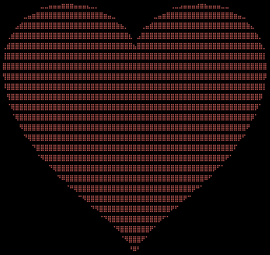

## 245 characters, Julia: Revolving hearts

```julia
   0:2e-3:2π    .|>d->(P=
 fill(5<<11,64 ,25);z=8cis(
d)sin(.46d);P[ 64,:].=10;for
r=0:98,c=0 :5^3 x,y=@.mod(2-
$reim((.016c-r/49im-1-im)z),
 4)-2;4-x^2>√2(y+.5-√√x^2)^
  2&&(P[c÷2+1,r÷4+1]|=Int(
    ")*,h08H¨"[4&4c+1+r&
      3])-40)end;print(
       "\e[H\e[1;31m",
         join(Char.(
            P)))
             );
```

Compact version:
```julia
0:2e-3:2π.|>d->((P=fill(5<<11,64,25))[64,:].=10;z=8cis(d)sin(.46d);for r=0:98,c=
0:5^3 x,y=@.mod(2-$reim((.016c-r/49im-1-im)z),4)-2;√2(y+.5-√√x^2)^2<4-x^2&&(P[c÷2+
1,r÷4+1]|=Int(")*,h08H¨"[1+r&3+4&4c])-40)end;print("\e[H\e[1;31m",join(Char.(P))));
```

<p align="center"></p>

Explained:

```julia
# rotation angle 'd' goes from 0 to 2π (one revolution)
0:2e-3:2π .|> d-> (
    # screen buffer, with empty braille characters and new lines
    (P = fill(5<<11,64,25))[64,:] .= 10;
    # transformation vector: cis = rotation, sin = zoom
    z = 8cis(d)sin(.46d);
    # loop over all pixels
    for r=0:98, c=0:5^3
        # (..)z = scale and rotate point, using complex numbers
        # reim = split complex number into x/y
        # mod = repeat pattern
        x,y = @.mod(2 - $reim((.016c-r/49im-1-im)z), 4) - 2;
        # test if point is within a heart shape
        √2(y+.5-√√x^2)^2 < 4-x^2 &&
            # set pixel, using braille characters
            (P[c÷2+1,r÷4+1] |= Int(")*,h08H¨"[1+r&3+4&4c]) - 40)
    end;
    # print buffer to screen
    print("\e[H\e[1;31m", join(Char.(P))));
```
