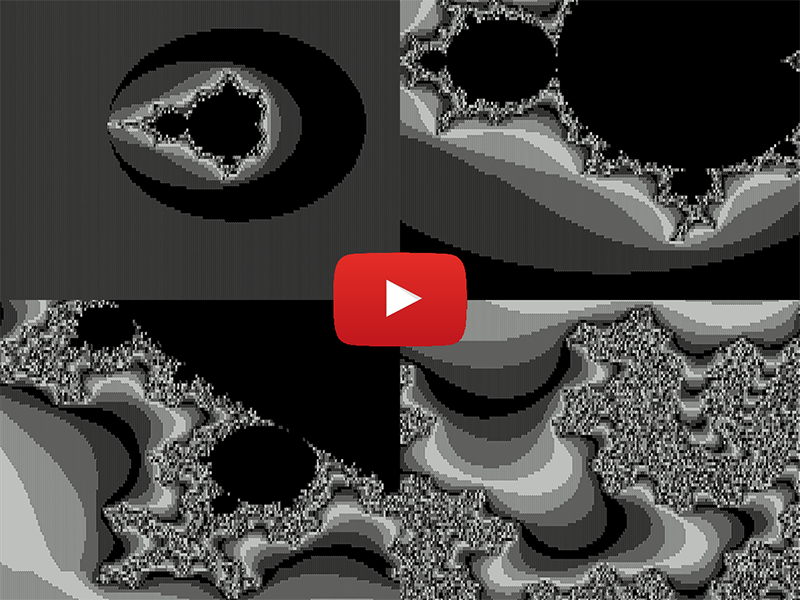

## 245 bytes: Mandelbrot fractal with animated zoom

```c#
var c=new char[20000];for(double z=1,x,y,t;z>1e-17;z*=.95){for(int r,n=0;n<2e4;c[n
++]="▓▒░ ░▒▓█\n"[n%200<1?8:r%8])for(r=0,x=y=0;x*x+y*y<4&++r<291;t=x*x-y*y-.55+(n%
200)*z/2-50*z,y=2*x*y+.55+(n/200-50)*z,x=t);Console.CursorTop=0;Console.Write(c);}
```

<p align="center">
<a href="https://maxbennedich.github.io/mandelbrot.gif"></a>
</p>

Explained:

```c#
// screen buffer (200x100 pixels)
var c = new char[20000];

// zoom loop (z = step size)
for (double z = 1, x, y, t; z > 1e-17; z *= .95)
{
    // loop over each pixel on screen and assign a color based on the escape time
    for (int r, n = 0; n < 2e4; c[n++] = "▓▒░ ░▒▓█\n"[n%200 < 1 ? 8 : r%8])

        // mandelbrot formula; max escape time = 291; center = (-0.55, -0.55)
        for (r = 0, x = y = 0; x*x + y*y < 4 & ++r < 291;
             t = x*x - y*y - .55 + (n%200)*z/2 - 50*z, y = 2*x*y + .55 + (n/200-50)*z, x = t);

    // draw frame to screen
    Console.CursorTop = 0;
    Console.Write(c);
}
```