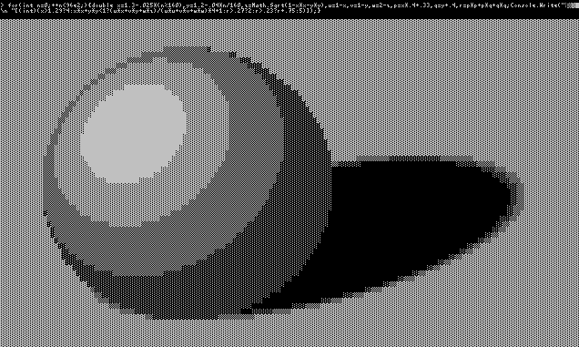

## 245 bytes: Ray tracer with specular highlighting and soft shadow casting

```c#
for(int n=0;++n<96e2;){double x=1.3-.025*(n%160),y=1.2-.04*n/160,z=Math.Sqrt(1-x*x
-y*y),u=1-x,v=1-y,w=2-z,p=x*.4+.33,q=y+.4,r=p*p+p*q+q*q;Console.Write("░▒▓█\n "[(
int)(x>1.29?4:x*x+y*y<1?(u*x+v*y+w*z)/(u*u+v*v+w*w)*4+1:r>.27?2:r>.23?r+.75:5)]);}
```

<p align="center"></p>

Explained:

```c#
// loop over screen (160x60 pixels)
for (int n = 0; ++n < 96e2; )
{
    double
        x = 1.3 - .025 * (n%160), // sphere x
        y = 1.2 - .04 * n/160, // sphere y
        z = Math.Sqrt(1 - x*x - y*y), // sphere z
        u = 1 - x, // light vector x
        v = 1 - y, // light vector y
        w = 2 - z, // light vector z
        p = x * .4 + .33, // shadow x
        q = y + .4, // shadow y
        r = p*p + p*q + q*q; // shadow shape

    Console.Write("░▒▓█\n "[(int)(
        x > 1.29 ? 4 : // new line
        // if on sphere, normalized scalar projection to get light:
        x*x + y*y < 1 ? (u*x + v*y + w*z) / (u*u + v*v + w*w) * 4 + 1 :
        r > .27 ? 2 : // background
        r > .23 ? r + .75 : // shadow edge (soft shadow)
        5)]); // shadow
}
```